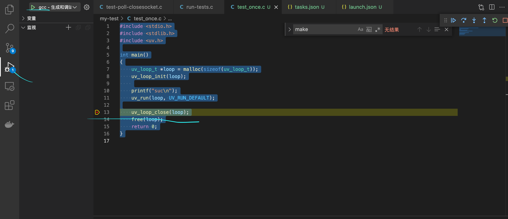

#mac 环境说明
- 系统: mac 10.15.7 
- vscode: 1.59.1
- python: 3.6.12
- libuv: 1.42

# 安装依赖
libtool 默认mac有自带  如果没有的话需要源码编译
```shell script
curl -O http://mirrors.kernel.org/gnu/libtool/libtool-2.4.6.tar.gz
tar xzvf libtool-2.4.6.tar.gz
cd libtool-2.4.6
./configure --prefix=/usr/local
make
sudo make install
```
automake，如果brew install automake 不能安装的话可以源码编译安装
```text
curl -O http://mirrors.kernel.org/gnu/automake/automake-1.16.4.tar.gz
tar xzvf automake-1.16.4.tar.gz
cd automake-1.16.4
./configure --prefix=/usr/local
make
sudo make install
```

# 下载libuv并编译
```shell script
git clone https://github.com/libuv/libuv.git
sh autogen.sh 
make -j4
make install
```
make生成.libs目录，里面是编译好的静态库，核心是 libuv.a 文件。
make install会把uh.h头文件复制到/usr/local/include/。libuv.a 复制到 /usr/local/lib

# vscode 调试
打开vscode加载libuv项目。
添加launch.json
```json5
{
    // 使用 IntelliSense 了解相关属性。 
    // 悬停以查看现有属性的描述。
    // 欲了解更多信息，请访问: https://go.microsoft.com/fwlink/?linkid=830387
    "version": "0.2.0",
    "configurations": [
        {
            "name": "gcc - 生成和调试活动文件",
            "type": "cppdbg",
            "request": "launch",
            "program": "${fileDirname}/${fileBasenameNoExtension}",
            "args": [],
            "stopAtEntry": false,
            "cwd": "${fileDirname}",
            "environment": [],
            "externalConsole": false,
            "MIMode": "lldb",
            "preLaunchTask": "C/C++: gcc 生成活动文件"
        }
    ]
}
```
添加tasks.json  注意args要添加-luv,因为libuv的头文件生成功到include/uv目录下
```json5
{
    "tasks": [
        {
            "type": "cppbuild",
            "label": "C/C++: gcc 生成活动文件",
            "command": "/usr/bin/gcc",
            "args": [
                "-g",
                "${file}",
                "-o",
                "${fileDirname}/${fileBasenameNoExtension}",
                "-luv"
            ],
            "options": {
                "cwd": "${fileDirname}"
            },
            "problemMatcher": [
                "$gcc"
            ],
            "group": {
                "kind": "build",
                "isDefault": true
            },
            "detail": "调试器生成的任务。"
        }
    ],
    "version": "2.0.0"
}
```
创建my-test/test-once.c
```cpp

#include <stdio.h>
#include <stdlib.h>
#include <uv.h>

int main()
{
    uv_loop_t *loop = malloc(sizeof(uv_loop_t));
    uv_loop_init(loop);
    
    printf("suc\n");
    uv_run(loop, UV_RUN_DEFAULT);

    uv_loop_close(loop);
    free(loop);
    return 0;
}

```
点击debug
