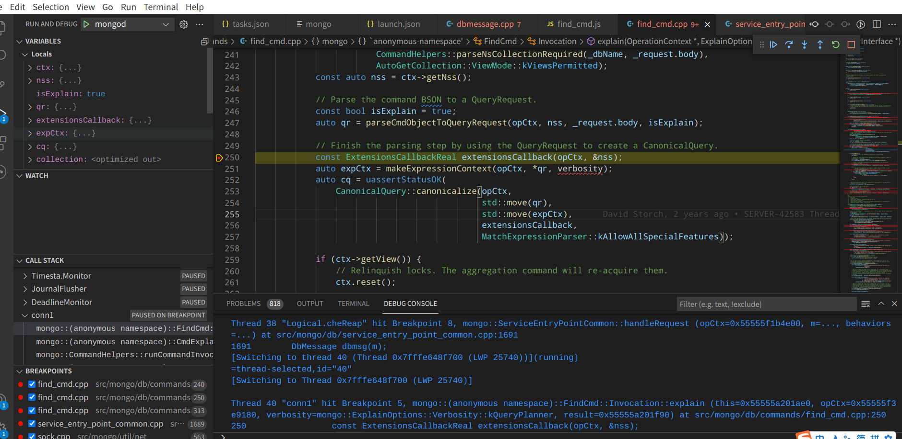

#mac 环境说明
- 系统: debian 10.6
- vscode: 1.61.1
- python: 3.7.3
- mongodb: 4.4
- gcc: 8.3.0
- pip: 20.x
- 参考build地址: https://github.com/mongodb/mongo/blob/v4.4/docs/building.md
# 安装依赖
```shell
sudo apt install  libcurl4-openssl-dev
sudo apt install liblzma-dev
```

# 安装mongod
```shell
git clone https://github.com/mongodb/mongo 
cd mongo
# 安装mongod mongo mongos
python3 buildscripts/scons.py install-core  
```

# vscode 调试
打开vscode加载mongo项目。安装c/c++(c/c++的支持、语法提示、调试等功能)和CodeLLDB(调试、断点等功能).
添加launch.json
```json5
{
  // 使用 IntelliSense 了解相关属性。 
  // 悬停以查看现有属性的描述。
  // 欲了解更多信息，请访问: https://go.microsoft.com/fwlink/?linkid=830387
  "version": "0.2.0",
  "configurations": [
    {
      "name": "mongod",
      "type": "cppdbg",
      "request": "launch",
      "program": "${workspaceRoot}/build/install/bin/mongod",
      // 这需要替换为dbpath的路径
      "args": ["--dbpath=/home/potens/data/mongodb"],
      "stopAtEntry": false,
      "cwd": "${fileDirname}",
      "environment": [],
      "externalConsole": false,
      "MIMode": "gdb"
    }
  ]
}
```
点击debug 启动mongod。 再启动./mongo 执行db.test.find().explain() 

