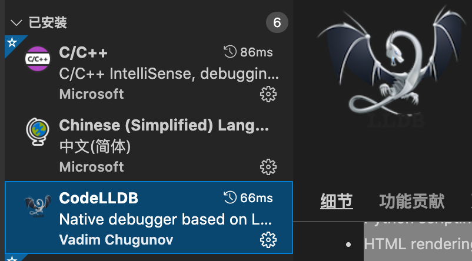
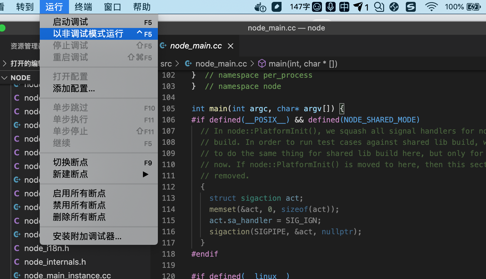
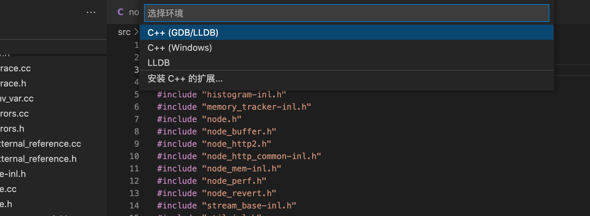
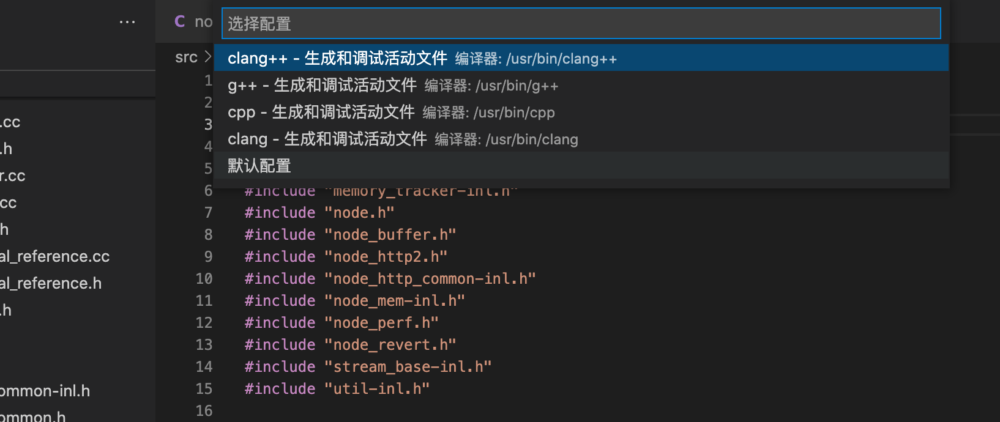
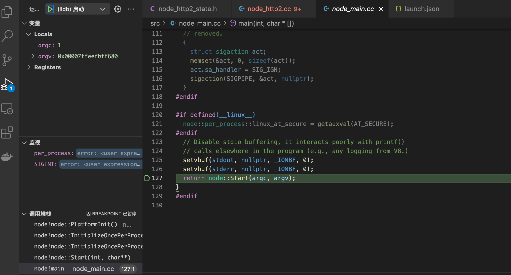

#mac 环境说明
- 系统: mac 10.15.7 
- vscode: 1.59.1
- node：v16
- python: 3.6.12

# 下载源码 编译 编译大概需要两个小时左右
```shell script
$ git clone https://github.com/nodejs/node.git
$ cd node
$ ./configure --debug
$ make -j4
```

# make过程中如果有libtool报错
Try 'libtool --help' for more information.
libtool:   error: unrecognised option: '-static' 
> 解决方法: 删除自己编译安装的libtool,使用mac自带的libtool, 才有-static参数。


# 编译完成
检查out/Debug是否生成了node可执行文件。如果没有生成，检查下错误解决后重新生成。

# 打开工程
用vscode打开项目。目录结构如下
```
├── benchmark       性能单元测试
├── deps            外部依赖
│   ├── acorn       JavaScript解析器
│   ├── brotli      压缩算法
│   ├── cares       异步DNS解析库
│   ├── cjs-module-lexer  CommonJS 模块语法词法分析器
│   ├── corepack    Node和包管理器之间的桥梁
│   ├── googletest  google测试框架
│   ├── histogram   高动态范围直方图
│   ├── icu-small 
│   ├── llhttp      http解析器
│   ├── nghttp2     http2库
│   ├── ngtcp2      实现QUIC和HTTP/3
│   ├── npm         包管理器
│   ├── openssl     TLS/SSL加密库
│   ├── uv          跨平台的异步IO库
│   ├── uvwasi      针对wasi的uv库
│   ├── v8          javascript引擎
│   └── zlib        数据压缩库   
├── doc             文档
├── lib             JavaScript实现的node标准库
├── out             编译输出目录
├── src             c/c++实现源码
├── test            单元测试
├── tools           工具类
└── typings         ts.d
```
# vscode安装插件
c/c++(c/c++的支持、语法提示、调试等功能)和CodeLLDB(调试、断点等功能)


# 如何开始调式
打开src/node_main.cc或者如何一个.cc文件，然后运行->以非调式模式运行

选择c++(GDB/LLDB)

选择默认配置

此时在.vscode中生成了launch.json文件，修改了program
```json
{
    // 使用 IntelliSense 了解相关属性。 
    // 悬停以查看现有属性的描述。
    // 欲了解更多信息，请访问: https://go.microsoft.com/fwlink/?linkid=830387
    "version": "0.2.0",
    "configurations": [
        {
            "name": "(lldb) 启动",
            "type": "cppdbg",
            "request": "launch",
            // 这里替换为编译生成的node路径
            "program": "${workspaceFolder}/out/Debug/node",
            "args": [],
            "stopAtEntry": false,
            "cwd": "${fileDirname}",
            "environment": [],
            "externalConsole": false,
            "MIMode": "lldb"
        }
    ]
}
```
切换到调式窗口 增加断点 就可以调式了



