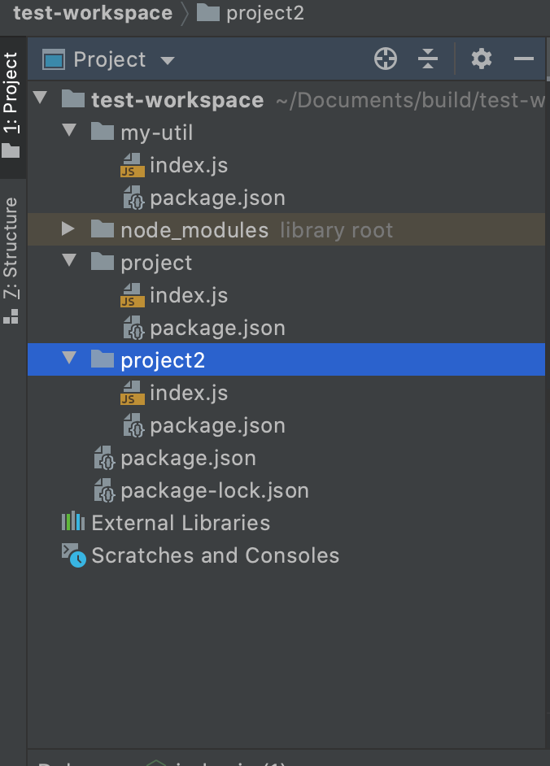

# 新功能介绍
npm7跟随nodejs v15一起发布，其中新增了workspaces(工作区) 和 自动安装peerDependencies(对等依赖) 两个功能。但总体来说它们都会将所有模块保存在一个共享文件夹中，让各个项目之间能够更容易共享软件包。而随着 NPM 最新版本的发布和 Arborist 的引入（一个新项目，包含了负责遍历和分析 npm_modules 文件夹内模块目录树的逻辑）。

> workspaces提供了从单一的顶级根包中管理本地文件系统中的多个包的支持。通俗点说就是多个项目可以共用一个node_modules.
> peerDependencies 在npm7之前，开发人员需要自己管理和安装peerDependencies。新的peer dependencies可确保在node_modules树中peerDependencies的位置处或之上找到有效匹配的 peerDependencies

# 下面通过一个简单的例子演示下
## 新建一个test-workspace项目 目录结构如下

- my-util: 工具类模块
- project: 项目1
- project2: 项目2

> 工作区的package.json如下 定义了工作区的包含哪些项目, 对应的名称为目录的名，并且支持正则匹配
```json
{
  "name": "test-workspace",
  "version": "1.0.0",
  "workspaces": [
    "my-util",
    "project",
    "project2"
  ]
}
```
> my-util的package.json如下 moment为对等依赖 lodash为当前项目依赖
```json
{
  "name": "my-util",
  "version": "1.0.0",
  "peerDependencies": {
    "moment": "2.29.1"
  },
  "dependencies": {
    "lodash": "~4.17.21"
  }
}
```
> my-util的index.js如下
```js
const moment = require("moment");
const _ = require("lodash");

exports.diff = function (date1, date2) {
    return moment(date1).diff(date2, "days");
}
exports.clone = function (obj) {
    return _.cloneDeep(obj);
}

```


> project的package.json如下  依赖了 my-util、koa。其中moment可以不写到package.json中，因为依赖了my-util,所以会自动安装
```json
{
  "name": "project",
  "version": "1.0.0",
  "dependencies": {
    "my-util": "1.0.0",
    "koa": "^2.13.1"
  }
}
```
> project的index.js如下 
```js
const MyUtil = require("my-util");
const moment = require("moment");
console.log(moment().format("YYYY-MM-DD HH:mm:ss"), MyUtil.diff(new Date("2021-02-01"), new Date("2021-01-01")))
console.log(moment().format("YYYY-MM-DD HH:mm:ss"), MyUtil.clone({a : [2]}))
```

## 在工作区执行npm install
node_modules只有在工作区的目录下才生成，project、project2、my-util都引用了moment，但是node_modules的moment只生成了一份。


