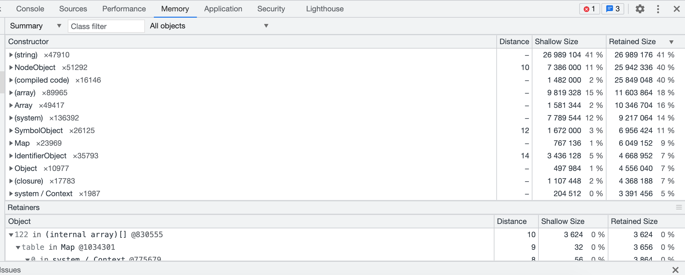
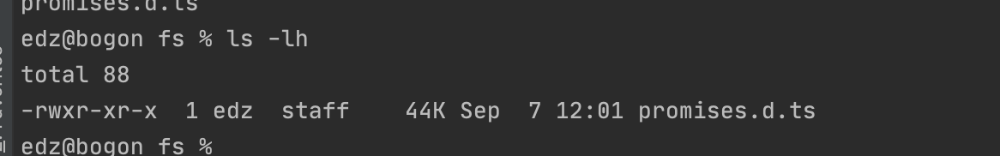
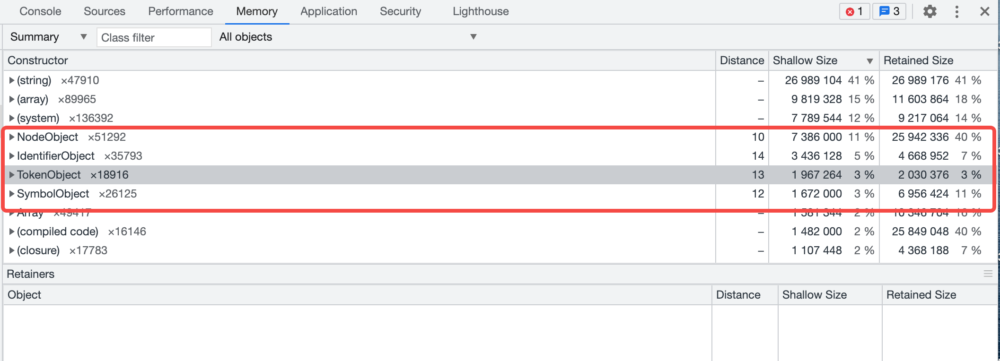

# 1 背景
最近发现typescript后端项目启动后内存就飙升到300MB，而且随着ts文件的增加，内存一直在上涨。
这对于一个nodejs后端项目占用的有点大了些，其他javascript的项目稳定在100MB左右。
# 2 准备排查
想着之前用过heapdump工具生成过快照，不过最新的node(node-v15之后)增加了Heap Profiler。
查了下文档的用法如下
```js
const inspector = require('inspector');
const fs = require('fs');
// 创建一个session
const session = new inspector.Session();
// 打开文件
const fd = fs.openSync('profile.heapsnapshot', 'w');
// session连接
session.connect();
// 监听HeapProfiler.addHeapSnapshotChunk 有触发就写入文件
session.on('HeapProfiler.addHeapSnapshotChunk', (m) => {
  fs.writeSync(fd, m.params.chunk);
});
// 触发HeapProfiler.takeHeapSnapshot 会阻塞主线程
session.post('HeapProfiler.takeHeapSnapshot', null, (err, r) => {
  console.log('HeapProfiler.takeHeapSnapshot done:', err, r);
  session.disconnect();
  fs.closeSync(fd);
});
```
# 3 先来个简单的测试  
把上面的代码复制到src/index.ts文件中, 再创建个package.json
```json
{
  "scripts": {
    "build": "tsc",
    "start-ts": "ts-node src/index.ts",
    "start": "node  lib/index.js"
  }
}
```
执行npm run start-ts, 竟然发现执行了16分钟了。生成的profile.heapsnapshot大概50M。
# 4 chrome分析内存快照
我们用chrome加载快照文件看下里面有些什么
- Shallow Size:对象自身占用的内存大小，不包括它引用的对象
- Retained Size: 当前对象大小+当前对象可直接或间接引用到的对象的大小总和
- distance: 表示当前对象到GC root的距离

可以看到string就占用到了41%,其中typescript.js占到了30% 第二fs/promises.d.ts




# 5 build生成js再测试一遍
1秒不到就可以生成快照文件，并且生成的文件只有3MB。占用最高的是inspect。


# 6 对比ts和js的内存快照
对比快照，发现多了很多对象(如: NodeObject、IdentifierObject、TokenObject、SourceFileObject等),不但数量多,而且占总内存的比例还是比较高。



# 7 浏览器调试
鉴于生成快照的方式比较慢，换成浏览器试试。启动脚本换成
```text
node --inspect --require ts-node/register src/index.ts 
```
src/index.ts修改为(保持主进程活动状态)
```typescript
import {setTimeout, setInterval} from "timers";

setInterval(() => {

}, 1000)
```
启动成功后 浏览器打开 chrome://inspect/#devices 点击inspect


# 8 总结
- 部署方式需要编译为js, 节省没必要的ts文件加载到内存, 并且加快运行速度。 本地可以用ts-node调试
- takeHeapSnapshot可以加到某个接口中，有问题的时候生成快照，本地可以借助浏览器。


